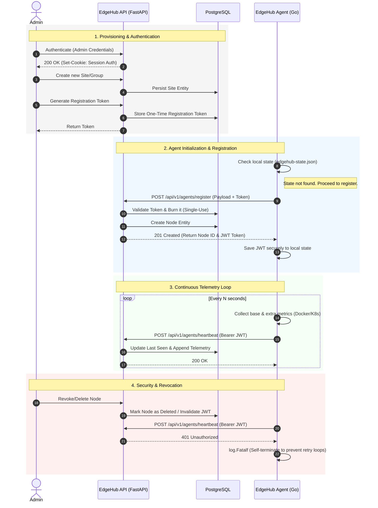

# EdgeHub: Lightweight Telemetry & Observability

EdgeHub is a high-performance telemetry and observability platform designed to monitor distributed edge devices, virtual machines, and containerized workloads.

Built to operate in highly constrained environments, it provides deep, centralized visibility into hardware utilization, Docker containers, and Kubernetes clusters.

## System Architecture

The platform operates on a strictly decoupled client-server architecture, divided into a Control Plane and a Data Plane.

### 1. EdgeHub Backend (Control Plane)

A robust, asynchronous REST API built with Python (FastAPI) and PostgreSQL. It serves as the central hub for node provisioning, secure agent authentication, and data ingestion.

* **Hybrid Data Schema:** Telemetry ingestion utilizes a hybrid database model. Core metrics (CPU, RAM, Disk, Uptime) adhere to a strict relational schema for high-performance querying. Conversely, an extensible `JSON` column dynamically captures environment-specific telemetry (e.g., Docker container states, Kubernetes pod health) without requiring database migrations.

### 2. EdgeHub Agent (Data Plane)

A zero-dependency, multi-architecture Go binary. It auto-detects its environment and operates on a push-based telemetry loop.

* **Linux Native (Systemd):** Executed as a background daemon. Designed for bare-metal servers, virtual machines, and IoT devices.
* **Docker Compose:** Operates within an isolated container. It binds to the host's Docker socket to monitor container states and mounts host system volumes read-only to accurately calculate underlying hardware utilization.
* **Kubernetes:** Deployed as a standard Deployment with specialized RBAC and `hostNetwork`/`hostPID` configurations. It bypasses container isolation to read the true underlying node metrics alongside cluster-wide telemetry.
* **Fail-Fast Security:** The agent respects immediate revocation from the control plane. If a node is deleted from the dashboard, the agent receives a 401 response and permanently self-terminates to prevent retry loops and resource drain.

---

## Request Lifecycle & Provisioning

The following sequence diagram illustrates the complete lifecycle: from an administrator authenticating and provisioning a node, to the agent securely registering and streaming telemetry.



---

## Quick Deploy (Control Plane)

The recommended method to deploy the **EdgeHub Backend and Dashboard** is via Docker Compose. This ensures all services (FastAPI, PostgreSQL, Nginx) are properly isolated and orchestrated.

Run the interactive installation script on your master server:

```bash
curl -sSL https://raw.githubusercontent.com/AndreaProzzo21/edge-hub/main/edge-hub-app/scripts/install.sh | sudo bash

```

### Production & Security Guidelines

EdgeHub is built with a **Bring Your Own Reverse Proxy (BYORP)** philosophy.

Out of the box, the Control Plane exposes the web dashboard and API on port `80` (HTTP). If you are deploying EdgeHub to the public internet, you must adhere to the following network requirements:

* **SSL/TLS Certificates:** Do not expose port 80 directly to the internet. Route your traffic through a secure tunnel (e.g., Cloudflare Tunnels) or place a Reverse Proxy (e.g., Nginx Proxy Manager, Traefik, Caddy) in front of EdgeHub to handle HTTPS termination.
* **CORS Configuration:** During installation, you will be prompted for a Dashboard URL. This value configures the `CORS_ORIGINS` variable. The API will strictly reject browser requests originating from any domain not explicitly listed here.
* **Rate Limiting:** The built-in Nginx container automatically applies Leaky Bucket rate limiting to critical endpoints (Login and Heartbeat) to protect the backend from brute-force attacks and malfunctioning edge agents.

---

## Deploying Agents

Agent deployment is managed directly from your EdgeHub Dashboard.

Once the Control Plane is online, log in to the web interface to generate secure registration tokens. The dashboard will provide the exact, pre-configured copy-paste commands to deploy agents across Linux natively, Docker Compose, or Kubernetes clusters.

---

## Developer API

EdgeHub provides a fully documented REST API. For implementation guides, database schemas, and endpoint references, please refer to our official documentation hosted on GitHub Pages.

**[View Official API Documentation](https://andreaprozzo21.github.io/edge-hub/)**